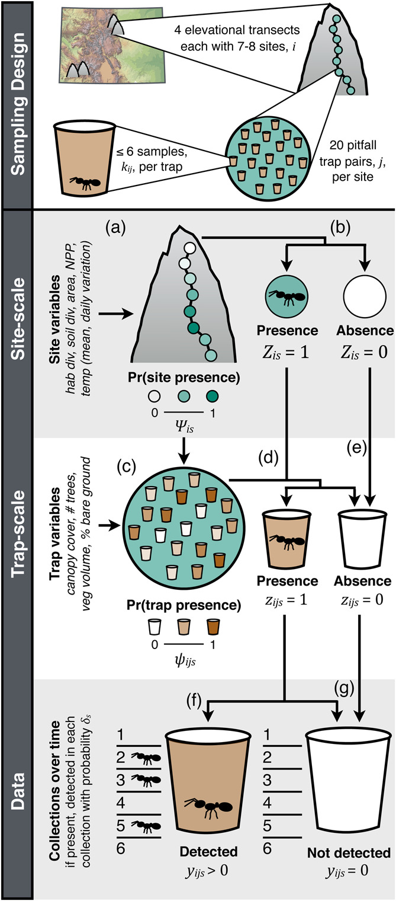

# Climbing a mountain of mountain data

## Project idea

This project centers around the question of how scale influences patterns of species richness along altitudinal gradients. Like in the exercise from Wednesday afternoon you are going to analyze a data set from the literature. This time it's a study on ants collected in the Rocky Mountains of Colorado, USA. You'll find the paper and the data in this folder. How does species richness vary with elevation in this data set? Do the patterns change with sampling scale? And are there differences between the two Mountain Ranges that were sampled? 

## Challenges

If you decide to do this project you will find yourself facing some challenges:

* **Making sense of the data**: You'll have the original data as they are provided by the study [here](https://datadryad.org/stash/dataset/doi:10.5061/dryad.rt679ng). You will notice that it's a bit tricky to make sense of them. But the site-by-species matrices that we want are buried in there - even at the scale of a single pitfall trap! Unfortunately, however, they do not have abundance data. Have a look at the supplementary material Appendix 2 to better understand the data structure. I can also provide you with a small script to get you started. 

* **Narrowing down your question**: This is really a mountain of data and there are many questions that you can ask. I suggest you focus on the scale-dependence of the species-richness-elevation-relationship. But which scales are you looking at? As a minimum,  the scale of a single pitfall trap (i.e. alpha) and the site scale (i.e. 20 pitfall traps, gamma). Note that with this data set we cannot look at the SAD because abundance was not recorded at the species level. However, the supplementary material provides information on the total number of individuals per site. Do you think abundance drives the observed species richness pattern?

* **Visualizing and analyzing the data**: Produce some plots to see the scale-dependence of the richness pattern. What stories do they tell?

* **Linking back to the original study**: Discuss your results in the light of the original study by Szewczyk and McCain. Use the analyses provided by the paper to try to better understand your own patterns.

## Overview of the study design:

*"Sampling design and model spatial structure. Four elevational gradients in Colorado were sampled, with two in the San Juans and two in the Front Range. Each gradient consisted of 7–8 sites, i, separated by ~250 m in elevation. At each site, 20 pairs of pitfall traps, j, collected insects. Traps were set for 90 d during the summer with up to 6 collections, kij, per trap. [...]"*

