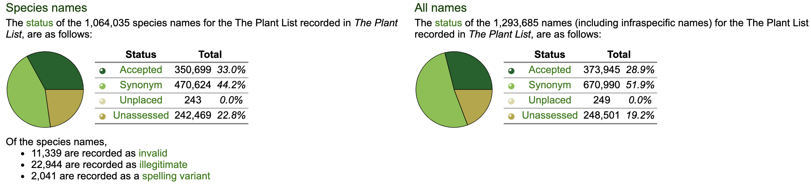

```{r setup, include=FALSE}
knitr::opts_chunk$set(echo = FALSE)
logo<-"img/iDiv_Logo_short.png"
```


## Accessing these materials

- Read the instructions on the readme, and lets take a few minutes to get set up and follow along together
 
<center>https://github.com/chase-lab/biodiv-patterns-course<center>


## R Markdown

This is an R Markdown presentation. Markdown is a simple formatting syntax for authoring HTML, PDF, and MS Word documents. When you click the **Knit** button a document will be generated that includes both content as well as the output of any embedded R code chunks within the document. Once Knitted, open in your browser using the button at the top! 

<center>{width=250px}</center>


## Its Monday, so ... a brief review

<center></center>

## What IS a species : The six kingdoms

- Plantae, Fungi, Animalia, Protista, Bacteria, Archaebacteria (single-celled organisms)

<center></center>


## What IS a species ? 
<center><center>


## Taxonomy is one of the biggest bioinformatics problems of all time
- [The Plant List](http://www.theplantlist.org/)

- [Taxize](https://github.com/ropensci/taxize/)

<center></center>
*Source: The Plant List*


## Where do we belong?
<center></center>

<center>[The Encyclopedia of Life](https://tinyurl.com/vjf8z9a</)<center>


## Where do we belong ? {.columns-2}
<center></center>

<center></center>


## Many ways to quantify species diversity 

<center><center>
*Pollock et al. 2017*


## Species interactions build ecosystems
<div style="float: left; width: 40%;">
- Species interact:
- Compete;
- Facilitate...
</div>

<div style="float: right; width: 60%;">
<center><center>
*Harvey et al. 2017*
</div>


## Feedback loops

<iframe width="560" height="315" src="https://www.youtube.com/embed/inVZoI1AkC8?start=15" frameborder="0" allow="accelerometer; autoplay; encrypted-media; gyroscope; picture-in-picture" allowfullscreen></iframe>


## Effects of disrupted feedback
<div style="float: left; width: 40%;">
- degredation
- decline
- an alternatively stable state
</div>

<div style="float: right; width: 60%;">
<center><center>
*Beisner et al. 2003*
</div>


## Ecosystems are changing

<center></center>
*Magurran 2016*


## But not always in obvious ways or on modern scales
<div style="float: left; width: 40%;">
- Again, scale matters: system, spatial, taxonomic, temporal
</div>

<div style="float: right; width: 60%;">
<center></center>
*Willis 2006*
</div>


## Ecology & Conservation
- Ecology is the study of how organisms interact with one another and with their physical environment. 

- Conservation biology is the management of nature and of Earth's biodiversity with the aim of protecting species, their habitats, and ecosystems from  extinction 

<center></center>


## How can you tell the difference?


## ...Or between this?


## ...Or this?


## It's not always that simple


## It's not always that simple


## It's not always that simple....


## So do we measure an ecosystem? 

- How do we know if its healthy or degraded ?
- How do we know if its functioning properly ?
- How do we know if its declining ?
- Or struggling ?
- How can we measure that ???

<center></center>

## Write down your ideas while the videos play

- What do all these things have in common ?
- What is measurable ?
- We will watch a series of videos for about 30 seconds each

<center></center>


## Ecosystems

<iframe width="560" height="315" src="https://www.youtube.com/embed/WhCsyFpG3Kg?start=495" frameborder="0" allow="accelerometer; autoplay; encrypted-media; gyroscope; picture-in-picture" allowfullscreen></iframe>


## Ecosystems

<iframe width="560" height="315" src="https://www.youtube.com/embed/nMAzchVWTis?start=2485" frameborder="0" allow="accelerometer; autoplay; encrypted-media; gyroscope; picture-in-picture" allowfullscreen></iframe>


## Ecosystems

<iframe width="560" height="315" src="https://www.youtube.com/embed/qZ0_aa6RxvQ?start=2016" frameborder="0" allow="accelerometer; autoplay; encrypted-media; gyroscope; picture-in-picture" allowfullscreen></iframe>


## Ecosystems

<iframe width="560" height="315" src="https://www.youtube.com/embed/L6JG_L-PWMA?start=2582" frameborder="0" allow="accelerometer; autoplay; encrypted-media; gyroscope; picture-in-picture" allowfullscreen></iframe>


## Ecosystems

<iframe width="560" height="315" src="https://www.youtube.com/embed/PC1XCR8r8sY?start=1209" frameborder="0" allow="accelerometer; autoplay; encrypted-media; gyroscope; picture-in-picture" allowfullscreen></iframe>


## Ecosystems

<iframe width="560" height="315" src="https://www.youtube.com/embed/QPGbkjrdD_s?start=3037" frameborder="0" allow="accelerometer; autoplay; encrypted-media; gyroscope; picture-in-picture" allowfullscreen></iframe>

## Ecosystems

<iframe width="560" height="315" src="https://www.youtube.com/embed/LQQRaYnIyK8?start=33" frameborder="0" allow="accelerometer; autoplay; encrypted-media; gyroscope; picture-in-picture" allowfullscreen></iframe>

## Ecosystems

<iframe width="560" height="315" src="https://www.youtube.com/embed/Bsjbyeztpd4?start=1842" frameborder="0" allow="accelerometer; autoplay; encrypted-media; gyroscope; picture-in-picture" allowfullscreen></iframe>


## Ecosystems

<iframe width="560" height="315" src="https://www.youtube.com/embed/L9zWDtDKDS8?start=30" frameborder="0" allow="accelerometer; autoplay; encrypted-media; gyroscope; picture-in-picture" allowfullscreen></iframe>


## The First Ecological Experimnent
" “It has been experimentally proved that if a plot of ground be sown with one species of grass, and a similar plot be sown with several distinct genera of grasses, a greater number of plants and a greater weight of dry herbage can thus be raised.” - Charles Darwin, Origin of Species

<center><center>
*Hector 2002*


## Biodiversity and Ecosystem Function {data-background=#8FBC8F}


*Tilman & Downing 1994*


## Biodiversity and Ecosystem Function {data-background=#8FBC8F}


*Naeem & Li 1997*


## A Field of Research is Born & Erupts {data-background=#8FBC8F}


## And... continues...

<center><center>
*Hooper 2016*


## And is extended to other ecosystem functions
<center><center>
*Hector 2007*


## The narrative supports conservation dialogue
<center><center>
*Isbell 2017*


## But inconsistencies exist
<center><center>
*Grace 2016*


## Patterns are variable
<center><center>
*Peterman 2010*


## Caution must be taken
<center><center>
*Leibold 2017*


## There are scale dependent expentations
<center><center>
*Isbell 2017*


## And ways to partition observed effects to explain different patterns
<center><center>
*Isbell 2018*


## Resource competition theory

- According to resource competition theory of all the species initially present in a habitat, the one
species with the lowest requirement for the resource woulddominate at equilibrium, displacing all other species. 

- On average, total plant biomass increases with diversity because better competitors produce more biomass and because the chance of having better competitors present increases with diversity
*Tilman 1997*


## Metacommunity dynamics affect all scales of  communities
<center><center>
*Chase et al. in review*


## So why wouldn't meta community dynamics and community assembly affect these processes as well?
- According to resouce competition theory we can expect different outcomes depending on the gains and losses of species of particular identities

- In situations where poor competitors are able to colonise, this could reduce biomass production

- In fragmented, human-dominated landscapes there are a few cases where this could happen; dispersal of weedy species, exotic species invasions, dispersal of species that are not well-adapted

-These scenarios flip the expectations of Biodiversity and ecosystem functioning on its head


## Community Assembly & the Functioning of Ecosystems (CAFE)

- After lunch we will explore an emerging method that partitions species  gains, species losses and persistent epecies effects on biomass production to understand the different effects these can have


## After disturbance some communities recover on their own...slowly & not completely
<center><center>
*Isbell_2019*


## Restoration 
<center><center>
*Temperton 2019*

## Restoration
<center><center>
*Suding 2004*


## Restoration; the practice of community reassembly, and a complimentary conservation action
<center></center>


