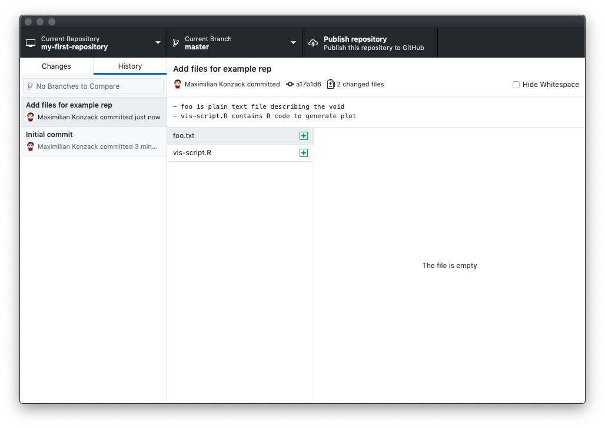
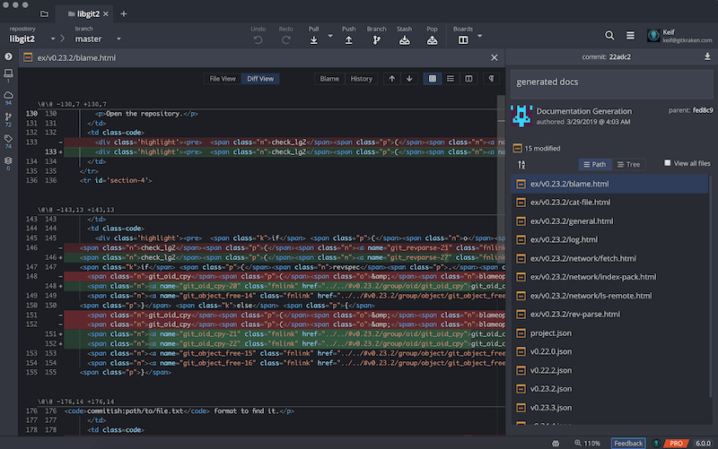
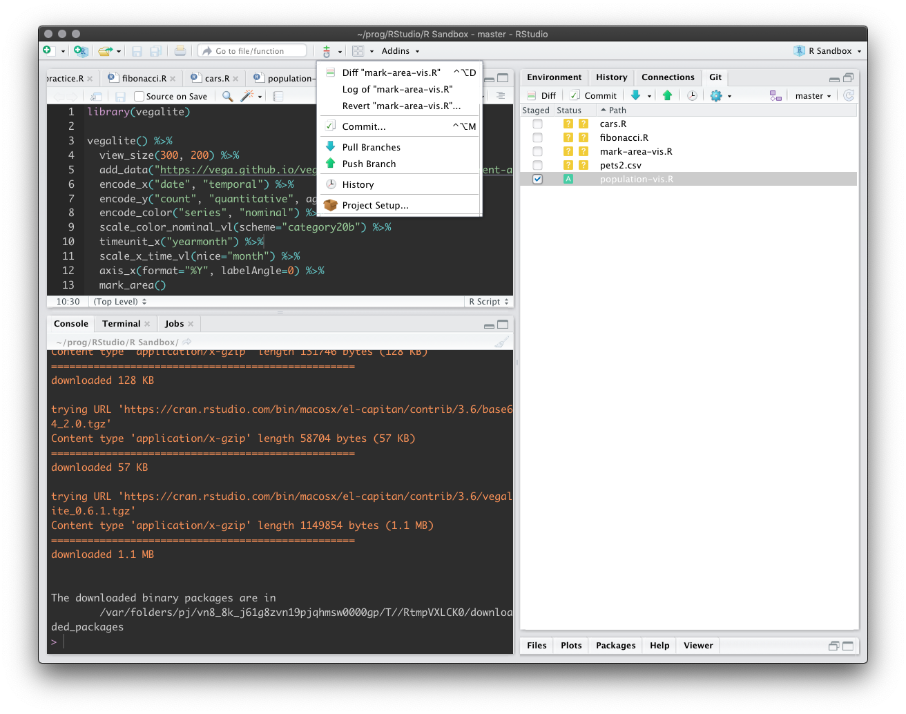
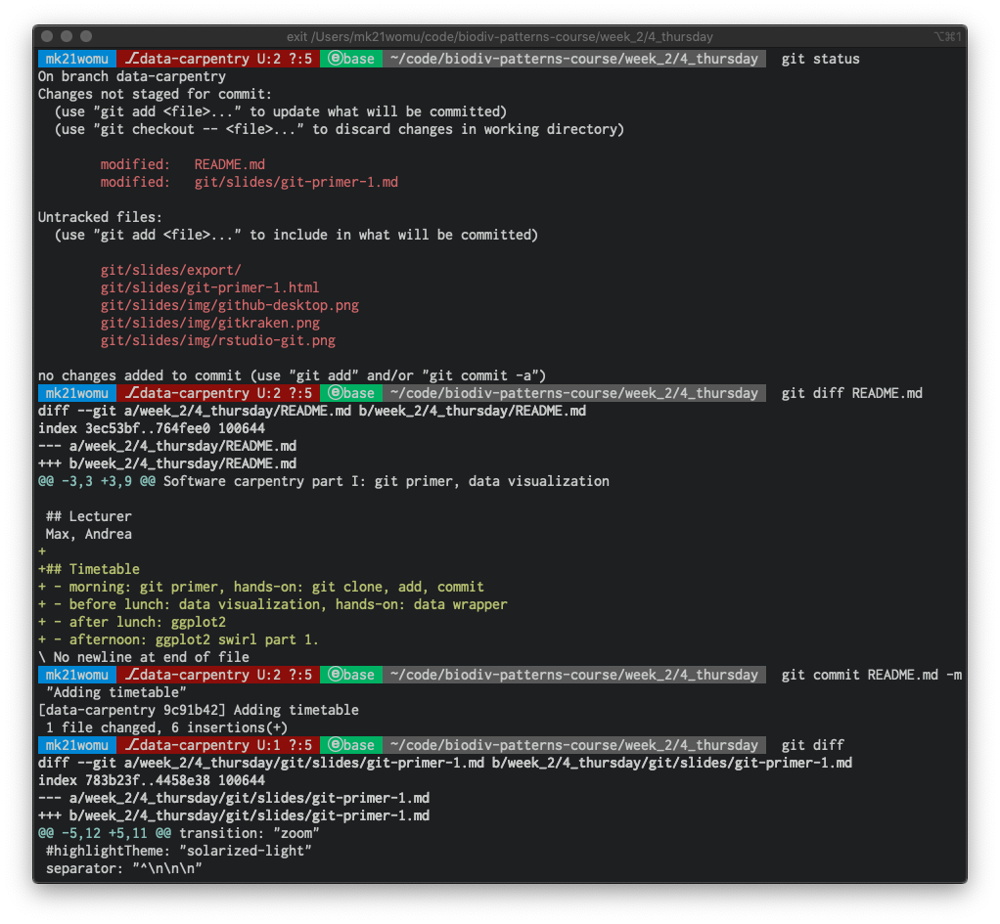

# Introduction to git


## Agenda
1. Understanding version control
2. How to use basic git commands
3. Hands-on with git
4. What's to learn after that


## Who has experience with version control?
- Dropbox, Nextcloud
- google drive, iCloud, OneDrive
- CVS, SVN
- git, mercurial, darcs


# What is version control?


## Filenames as version control


## Local version control


## Centralized VCS


## Distributed VCS


## What is VCS?

<iframe src="https://player.vimeo.com/video/41027679?title=0&byline=0&portrait=0" width="888" height="500" frameborder="0" allow="autoplay; fullscreen" allowfullscreen></iframe>


# What is git?


## A distributed version control system!
- work offline
- undo errors
- track content, not files
- small changes
- keep history
- working with others
- don't panic


## git in a nutshell


## delta-based version control system


## Stream of snapshots


## Summary
```git```
1. keeps a timeline
2. handles most operations locally
3. leaves unchanged files as they are
4. maintains "deltas"/diffs of a changed file
5. has three states that a file can have
   - ```modified```
   - ```staged```
   - ```committed```


## Three stages


# ```git``` primer


## Install git
- [x] Mac: already installed
- [ ] Linux: consult your package manager
- [ ] Windows: download

https://git-scm.com/download


## Setup git
```bash
# configure your identity
git config --global user.name  'Jane Doe'
git config --global user.email 'jane.doe@riot-grrrl.org'
```


## command line
### description syntax

```bash
# command
git

# sub-command
git status

# argument
git diff README.md

# every git command
git command [arguments]

# get help
git help [command]
```


## command line
### bash basics

```bash
pwd           # print working directory
ls [dir]      # list directory contents
echo msg      # print message
cd [dir]      # change directory
mkdir dir     # create directory
rmdir dir     # remove directory
rm file       # remove file
cp src dest   # copy from source to destination
mv src dest   # move / rename
```

```bash
nano file     # edit file (Linux / Mac)
notepad file  # edit file (Windows)
```


## git basic commands
```bash
# 0. Initialize the git project (stored in .git subdir).
$ git init my-first-git-project
# 1. Change the directory to the project.
$ cd my-first-git-project
# 2. Stage/add our first script.
$ git add data-viz-script.R
# 3. What is the current status of the files?
$ git status
# 4. Commit our current changes with a message.
$ git commit -m "Adding r code to visualize data"
# 5. Check the deltas/changes in the project.
$ git diff
```


## git server
```bash
# 1. Commit your changes locally
$ git commit [fileA subDirF] -m "[Action] on ... to ..."

# 2. Pull changes from the server
$ git pull

# 3. Push your changes to the server
$ git push
```


## Setup git server

1. Clone an existing project hosted from a git server (GitHub, GitLab, Bitbucket)
```bash
$ git clone\
 https://github.com/chase-lab/biodiv-patterns-course.git
```
2. Connect your local repository to a Git server (GitHub, GitLab, Bitbucket)
```bash
$ git remote add origin\
 https://github.com/komax/my-new-project.git
```


# git clients


## GitHub Desktop




## GitKraken




## git in RStudio




## git in the shell




# Advanced ```git``` skills


## Branching in a nutshell


## Branching


## Create a branch


## Commit in a branch


## Git basics
<iframe src="https://player.vimeo.com/video/41381741?title=0&byline=0&portrait=0" width="888" height="500" frameborder="0" allow="autoplay; fullscreen" allowfullscreen></iframe>


## Thank you for your attention


# Literature


##
https://git-scm.com/book/en/v2


- https://git-scm.com/
- https://git-scm.com/docs/gittutorial


## GitHub resources
- https://try.github.io/
- https://github.github.com/training-kit/downloads/de/github-git-cheat-sheet/


## iDiv GSU
- https://idiv-biodiversity.github.io/git-cheat-sheet/
- [Git basics course](https://www.idiv.de/de/ydiv/lehrveranstaltungen/git-basics-for-beginner-level-git-users.html)

Thank you, Dirk and Christian
