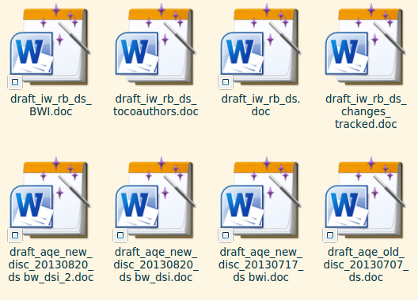

# Introduction to git

## Agenda
1. Understanding version control
2. How to use basic git commands
3. Hands-on with git
4. What's next

## Who has experience with version control?
- Dropbox, Nextcloud
- google drive, iCloud, OneDrive
- CVS, SVN
- git, mercurial, darcs

# What is version control?

## Filenames as version control

## Local version control

# What is git?

# git clients

# git primer

# Beyond git

## Getting up
- Turn off alarm
- Get out of bed

## Breakfast
- Eat eggs
- Drink coffee

# In the even

## Dinner
- Eat spaghetti
- Drink wine

## Going to sleep
- Get in bed
- Count sheep